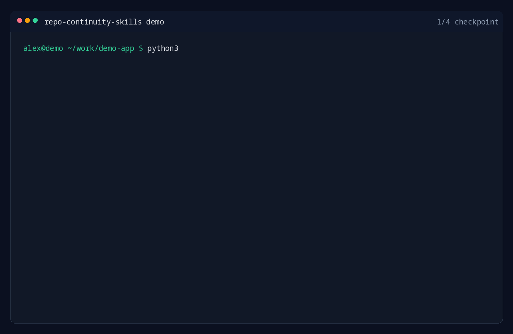

# agent-checkpoint

[](https://opensource.org/licenses/MIT)
[](https://www.python.org/)
[](#how-it-works)
**English** | [**中文**](./README.zh-CN.md)

Repo-local continuity skills for coding agents.

These two skills turn "I lost the thread" into a recoverable workflow: save the
real working lane into the repository itself, then restore it in the next
session without depending on fragile external chat memory.

## Demo



## What It Does

- **repo-checkpoint** — writes a timestamped markdown handoff under
  `.agents/checkpoints/`, including session goal, current state, key chat
  context, files in play, verification state, next step, and a git snapshot.
- **repo-resume** — restores the latest active lane from the newest checkpoint
  plus current branch, working tree, and recent commits.

**Why this exists:** Most agents can reread code. What they usually lose is the
human context: what the user actually wanted, what was already tried, which
constraints mattered, and what the next concrete step should be.

## Why It Matters

- **Repo-local, not session-local** — the handoff lives inside the repo, so it
  survives model switches, browser restarts, shell reconnects, and machine
  changes.
- **Plain markdown, no lock-in** — checkpoints are readable in any editor and
  reviewable in git.
- **Fast cold start** — resume goes straight to the last known lane instead of
  broad repo exploration.
- **Human context included** — goal, constraints, rejected paths, and next
  actions are captured explicitly.
- **Works even without an agent runtime** — both scripts can be run manually.

## Best For

- long-running debugging or refactor sessions
- interruptions during implementation or review
- switching between local machine, remote box, and another agent session
- repos where "what were we actually doing?" is more expensive than reading the
  code

## Quick Start

```bash
git clone https://github.com/hotalexnet/agent-checkpoint.git
cd agent-checkpoint
bash install-repo-skills.sh
```

From the target repo root:

```bash
# End of session: create a scaffold, then fill in the TODOs
python3 ~/.agents/skills/repo-checkpoint/scripts/save_checkpoint.py \
  --title "chat-routing-root-cause"

# Next session: recover the latest lane
python3 ~/.agents/skills/repo-resume/scripts/resume_snapshot.py
```

## Example Flow

```text
Session A:
- investigating a routing bug
- several files open
- one failed approach already ruled out
        ↓
repo-checkpoint
        ↓
.agents/checkpoints/20260513-114233-chat-routing-root-cause.md
        ↓
Session B starts later on the same or another machine
        ↓
repo-resume
        ↓
latest checkpoint + branch + working tree + recent commits
        ↓
continue from the real next step instead of re-deriving intent
```

## What Gets Saved

Each checkpoint keeps these top-level sections:

- `Session Goal`
- `Current State`
- `Key Chat Context`
- `Files In Play`
- `Verification`
- `Next Step`
- `Resume Recipe`
- `Git Snapshot`

That is the real value here: not just code state, but the reasoning state around
the code.

## Example Checkpoint Content

```md
## Session Goal
- Fix the chat fallback so non-matching questions stop returning stale onboarding guidance.

## Current State
- Router fix is implemented locally.
- Local smoke test passed.
- Staging behavior still needs separate verification.

## Key Chat Context
- User wants root-cause-level cleanup, not a keyword patch.
- Old onboarding copy must stop leaking into normal chat replies.
- Do not broaden scope into model switching yet.

## Files In Play
- src/chat/router.py
- src/prompts/chat_prompt.py
- tests/test_chat_router.py

## Next Step
1. Reproduce against the current deploy path.
2. Verify fallback selection with 3 representative prompts.
3. Commit only after the bad greeting path is gone.
```

## Install

### Prerequisites

- `python3`
- `git`
- a skill runtime that loads skills from `~/.agents/skills`, or a vendored
  skill path inside your own tooling

### Option 1: Run the installer

```bash
bash install-repo-skills.sh
```

Default install target:

```bash
~/.agents/skills
```

Custom install target:

```bash
bash install-repo-skills.sh --target /path/to/skills
```

### Option 2: Clone the repo

```bash
git clone https://github.com/hotalexnet/agent-checkpoint.git
cd agent-checkpoint
bash install-repo-skills.sh
```

### Option 3: Copy the skill folders directly

```bash
mkdir -p ~/.agents/skills
cp -R repo-checkpoint ~/.agents/skills/
cp -R repo-resume ~/.agents/skills/
```

## Usage

| Trigger or need | Action |
|-----------------|--------|
| "save progress" / "checkpoint this" | run `repo-checkpoint` |
| "continue where we left off" / "what was I doing?" | run `repo-resume` |
| "show all checkpoints" | run `repo-resume list` |
| "clean up old checkpoints" | run `repo-resume prune 5` |

Manual commands from the target repo root:

```bash
python3 ~/.agents/skills/repo-checkpoint/scripts/save_checkpoint.py --title "my-work"
python3 ~/.agents/skills/repo-resume/scripts/resume_snapshot.py
python3 ~/.agents/skills/repo-resume/scripts/resume_snapshot.py list
python3 ~/.agents/skills/repo-resume/scripts/resume_snapshot.py prune 5
```

## Recommended Workflow

### 1. Before closing a session

Run `repo-checkpoint`, then replace every `TODO` with concrete session state.

### 2. When reopening later

Run `repo-resume` first, before broad repo exploration.

### 3. Keep the checkpoint executable

A good checkpoint should answer these questions fast:

- What are we trying to finish?
- What is already true?
- What must not be broken?
- Which files matter first?
- What should happen next?

## Why Repo-Local Beats External Chat Memory

- external session memory is often unavailable, partial, or tool-specific
- a repo-local handoff travels with the codebase
- teammates and future-you can inspect it without special software
- the checkpoint can be committed, ignored, copied, or archived with normal git
  habits

## How It Works

```text
Current coding session
    ↓
repo-checkpoint
    ↓
Timestamped markdown handoff under .agents/checkpoints/
    ↓
New session starts later
    ↓
repo-resume
    ↓
Latest checkpoint + current git state
    ↓
Continue the exact lane with minimal cold-start cost
```

## Compatibility

- Any git repository
- Local machine or remote server
- Cross-machine reuse by cloning or copying the skill folders
- Manual CLI use, even if your agent runtime does not auto-load skills

## Multi-Machine Usage

You can either:

- clone this repository on another machine and run the installer, or
- copy `repo-checkpoint/` and `repo-resume/` directly into that machine's
  `~/.agents/skills/`

## Updating

If you already installed an older version, rerun:

```bash
bash install-repo-skills.sh
```

The installer replaces:

- `~/.agents/skills/repo-checkpoint`
- `~/.agents/skills/repo-resume`

## Limits

- Resume quality depends on checkpoint quality.
- The scaffold is intentionally simple; it does not auto-summarize your whole
  session for you.
- If you leave the `TODO`s blank, future-you still has to reconstruct intent.

## .gitignore

Checkpoints are stored under `.agents/checkpoints/`. You can either commit them
(so teammates can resume each other's work) or gitignore them (private notes):

```gitignore
# Option A: ignore all checkpoints
.agents/checkpoints/

# Option B: keep them in git — add nothing to .gitignore
```

## Project Structure

```text
agent-checkpoint/
├── README.md
├── README.zh-CN.md
├── CHANGELOG.md
├── VERSION
├── LICENSE
├── assets/
│   └── demo.gif
├── install-repo-skills.sh
├── dist/
│   └── repo-skills-bundle.tar.gz
├── repo-checkpoint/
│   ├── SKILL.md
│   └── scripts/
│       └── save_checkpoint.py
├── repo-resume/
│   ├── SKILL.md
│   └── scripts/
│       └── resume_snapshot.py
├── tests/
│   ├── conftest.py
│   ├── test_checkpoint.py
│   └── test_resume.py
└── scripts/
    └── generate_demo_gif.py
```

## License

[MIT License](LICENSE)

## Acknowledgments

- Repo-local continuity workflow patterns developed during long-running coding
  sessions
- Git, for making branch and working tree state easy to snapshot and recover

---

⚠️ **Note:** Concrete files, constraints, verification state, and next actions
are what make resume fast. The more specific your checkpoint is, the more
valuable the next session becomes.
